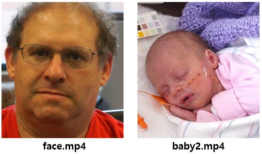
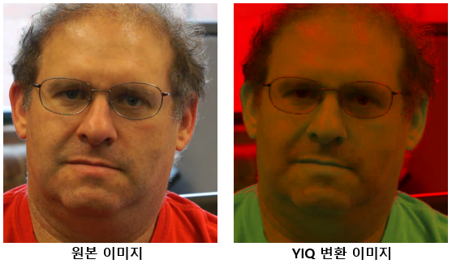
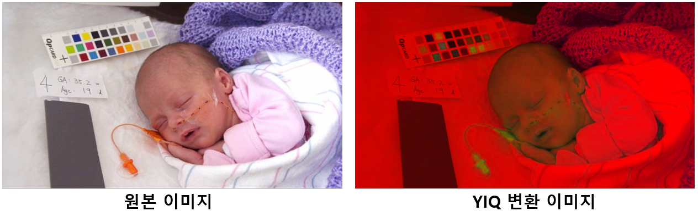
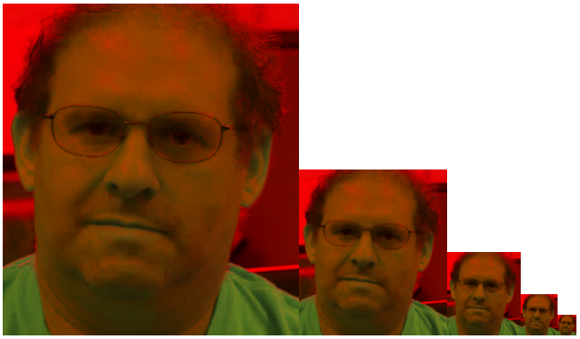
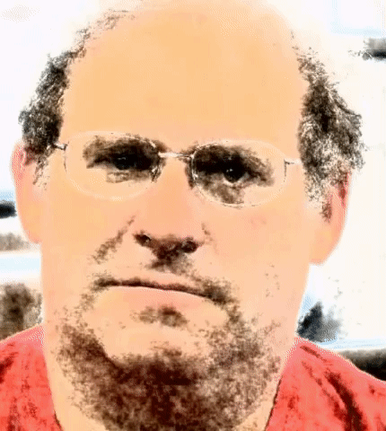

# Homework Assignment 2 
### Eulerian Video Magnification

<p align='right'>
  2021314078 배은지
</p>

Eulerian Video Magnification : 육안으로 볼 수 없는 미묘한 변화들을 추출하는 알고리즘

<p align='center'>
  
</p>

두 동영상 ( face, baby ) 에서 아래와 같은 순서로 진행
1. If your video has color, transform it to an appropriate color space.
2. Create a Laplacian pyramid for each video frame.
3. Band-pass filter the time series for each pixel, on all levels of the pyramid.
4. Magnify bands of interest by some scale.
5. Reverse the Laplacian pyramid and undo the color transform to obtain the final output.

### INITIALS AND COLOR TRANSFORMATION
- Load the video file
- extract frames
- convert double-precision in the range [0,1]
- convert YIQ color space (RGB ↔ YIQ : rgb2ntsc ↔ ntsc2rgb)

<p align='center'>
  
  
</p>

```matlab
video = VideoReader('data/baby2.mp4');
%video = VideoReader('data/face.mp4');

Fs = round(video.FrameRate);
l=video.Duration * video.FrameRate;
length = round(l);
h = video.Height;
w = video.Width;
ch = video.BitsPerPixel / 8;

frame_list = zeros(h, w, ch, length);

for frame_index = 1: length-1
    video.CurrentTime = frame_index * 1 / video.FrameRate;
    frame = readFrame(video);
    frame = double(frame) / 255;
    frame = rgb2ntsc(frame);
    frame_list(:, :, :, frame_index) = frame(:, :, :);
end

video.CurrentTime = l * 1 / video.FrameRate;
frame = readFrame(video);
frame = double(frame) / 255;
frame = rgb2ntsc(frame);
frame_list(:, :, :, frame_index) = frame(:, :, :);
[h, w, ch, frame_num] = size(frame_list);
```

### LAPLACIAN PYRAMID
- 모든 단일 프레임에 대해 laplacian pyramid 구성
- gaussian pyramid에서의 차이를 이용
- w × h → (w/2) × (h/2) 이기 때문에 차이를 계산할 때 upsampling 요구
- 이 과정을 역으로 수행하면 원본 이미지로 재구성할 수 있음 → 비디오 보강에 활용 가능

```matlab
list1 = impyramid(frame_list, 'reduce');
list2 = impyramid(list1, 'reduce');
list3 = impyramid(list2, 'reduce');
list4 = impyramid(list3, 'reduce');
```
<p align='center'>
  
</p>

### TEMPORAL FILTERING
- fft(Fast Fourier Transform) 을 사용하여 주파수 영역으로 변환
- 이 신호에 대역 통과 필터 적용
- 이 비디오에 적합한 필터를 찾아야 함

```matlab
[h, w, ch, frame_num] = size(frame_list);
f = Fs * (0:(fix(frame_num/2)))/frame_num;

cube_fft = zeros(fix(frame_num/2)+1, 1);
cube_pixel = zeros(frame_num, 1);

for i = 1:h
    for j = 1:w
        cube_pixel(:,1) = gaussian_0(i,j,1,:);
        fftx = fft(cube_pixel);
        
        P2 = abs(fftx/frame_num);
        P1 = P2(1:fix(frame_num/2)+1);
        P1(2:end-1) = 2*P1(2:end-1);
        cube_fft(:,1) = cube_fft(:,1) + P1(:,1);
    end
end
```

### EXTRACTING THE FREQUENCY BAND OF INTEREST
- 제공된 butterworthBandpassFilter 함수 사용 → 주파수 증폭 후 결과를 원래 신호에 다시 추가
- 동영상의 주파수 대역을 분석해 주파수 대역의 초점을 맞춤
  - baby 동영상의 경우 First Cutoff Frequency = 0.8, Second Cutoff Frequency = 1 로 설정
  - face 동영상의 경우 First Cutoff Frequency = 0.6, Second Cutoff Frequency = 0.7 로 설정
 
```matlab
bp = butterworthBandpassFilter(Fs, 256, 0.83, 1);

residual_0_filtered = filter_cube(bp, gaussian_0);
residual_1_filtered = filter_cube(bp, gaussian_1);
residual_2_filtered = filter_cube(bp, gaussian_2);
residual_3_filtered = filter_cube(bp, gaussian_3);
gaussian_4_filtered = filter_cube(bp, gaussian_4);

clear('bp');
```

```matlab
function cube_filtered = filter_cube(bp, cube)
    [height, width, ch, frame_count] = size(cube);

    cube_filtered = zeros(height, width, ch, frame_count);
    cube_pixel = zeros(frame_count, 1);
    
    Hd_fft = freqz(bp, frame_count);

    for i = 1: height
        for j = 1: width
            cube_pixel(:,1) = cube(i,j,1,:);
            cube_pixel_fft = fft(cube_pixel);
            cube_pixel_filtered = abs(ifft(cube_pixel_fft .* Hd_fft));
            cube_filtered(i,j,1,:) = cube_pixel_filtered(:, 1);
        end
    end
end
```

### IMAGE RECONSTRUCTION
-Laplacian pyramid를 프레임 당 단일 이미지로 축소

```matlab
frame_list_reconstructed = zeros(h, w, ch, frame_num);
alpha_0 = 100;
alpha_1 = 100;
alpha_2 = 100;
alpha_3 = 100;
alpha_4 = 100;

image_residual_0_re = zeros(size(residual_0_filtered,1), size(residual_0_filtered,2), ch); % re means reconstructed
image_residual_1_re = zeros(size(residual_1_filtered,1), size(residual_1_filtered,2), ch);
image_residual_2_re = zeros(size(residual_2_filtered,1), size(residual_2_filtered,2), ch);
image_residual_3_re = zeros(size(residual_3_filtered,1), size(residual_3_filtered,2), ch);
image_gaussian_4_re = zeros(size(gaussian_4_filtered,1), size(gaussian_4_filtered,2), ch);

for t = 1: frame_num

    image_residual_0_re(:,:,1) = residual_0_filtered(:,:,1,t);
    image_residual_1_re(:,:,1) = residual_1_filtered(:,:,1,t);
    image_residual_2_re(:,:,1) = residual_2_filtered(:,:,1,t);
    image_residual_3_re(:,:,1) = residual_3_filtered(:,:,1,t);
    image_gaussian_4_re(:,:,1) = gaussian_4_filtered(:,:,1,t);
    
    image_reconstructed_frame = frame_list(:,:,1,t) + alpha_0 * image_residual_0_re + alpha_1 * imresize(image_residual_1_re, 2) + ...
        + alpha_2 * imresize(image_residual_2_re, 4) + alpha_3 * imresize(image_residual_3_re, [h, w]) + alpha_4 * imresize(image_gaussian_4_re, [h, w]);
    
    frame_list_reconstructed(:,:,1,t) = image_reconstructed_frame(:,:,1);
 
end

frame_list_reconstructed(:,:,2:ch,:) = frame_list(:,:,2:ch,:);
```

```matlab
for t = 1: frame_num
    frame_list_reconstructed(:,:,1,t) = imadjust(frame_list_reconstructed(:,:,1,t), stretchlim(frame_list_reconstructed(:,:,1,t)));

    cube_frame(:,:,:) = frame_list_reconstructed(:,:,:,t);

    % YIQ to RGB
    cube_frame = ntsc2rgb(cube_frame);

    writeVideo(v,cube_frame);
end
```

### RESULT
- 아기의 호흡과 사람 피부의 미묘한 움직임을 더 잘 확인할 수 있음
<p align='center'>
  
  
</p>


### EXTRA CREDIT: CAPTURE AND MOTION-MAGNIFY YOUR OWN VIDEO
- 고양이의 움직임이 더 잘 보임
- 전체적으로 카메라도 흔들려서 baby나 face 동영상만큼 뚜렷한 결과는 얻지 
<p align='center'>
  
</p>
