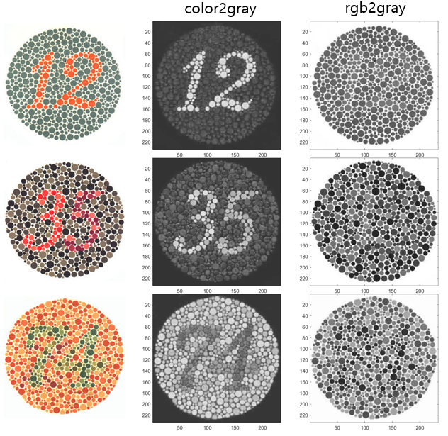

# Homework Assignment 3 
## Implement Poisson Belending

<p align='right'>
  2021314078 배은지
</p>

본 과제는 gradient-domain processing 을 하고자 하며, 그 중에서도 particular Poisson blending 에 중심을 두었다
Poisson blending은 아래 수식을 통해 공식화 할 수 있다.


## TOY PROBLEM
먼저 gradient domain processing 을 구현하였다.
이미지 s의 x와 y 그래디언트를 계산한 후 이 값들을 이용해 이미지 v를 재구성하였을 때, 재구성된 이미지와 원본 이미지가 일치하기를 원한다.
이를 위해 다음과 같은 과정을 진행하였다.

1. Minimize 
2. Minimize 
3. Minimize 

이를 하나의 최소 제곱 문제  로 결합한다.

여기서 A는 `sparse matrix`, v는 `variables` , b는 `known vector` 이다.

먼저 `im2var`을 이용해 픽셀들을 매핑시켰다.

```matlab
[imh, imw, nn] = size(toyim);
im2var = zeros(imh, imw);
im2var(1:imh*imw) = 1:imh*imw;

A = sparse(((imh*(imw-1))+(imh-1)*imw)+1, imh*imw);
b = zeros(imh*imw, nn);
e = 0;
```

v와 s의 기울기 차이를 계산하였다.

```matlab
for x = 1:imh
    for y = 1:imw-1
        e = e+1;
        A(e,im2var(x,y+1)) = 1;
        A(e,im2var(x,y)) = -1;
        b(e) = toyim(x,y+1) - toyim(x,y);
    end
end

for x = 1:imh-1
    for y = 1:imw
        e = e+1;
        A(e,im2var(x+1,y)) = 1;
        A(e,im2var(x,y)) = -1;
        b(e) = toyim(x+1,y) - toyim(x,y);
    end
end
```
연산자 `v = A\b;` 을 이용하여 이미지를 재구성하였다.

```matlab
A(e+1, im2var(1,1)) = 1;
b(e+1) = toyim(1,1);
v = A\b;
im_out = reshape(v, imh, imw);
```
수식 `num2str(sqrt(sum(toyim(:)-im_out(:))))`을 통해 에러 값을 출력한 결과, 에러 값은 `0+2.5417e-06i` 이므로 재구성한 이미지와 원본 이미지는 동일하다고 볼 수 있다.
<p align='center'>
  
</p>

## POISSON BLENDING
다음으로 poisson blending 시킨 결과를 보고자 하였다.
여기에는 세가지 과정이 필요하다.
1. 합성될 이미지에서의 영역 경계 선택 및 배경이 될 이미지에서의 위치 지정
2.  공식화
3. 2번 결과를 이미지로 복사

제공된 getMask, alignSource 함수를 이용하여 1번 과정을 쉽게 할 수 있었으며, 그 이후의 과정을 라플라스 변환을 활용하여 구현하였다.

```matlab
for y = 1:imh
    for x = 1:imw
        e = e+1;
        if mask_s(y,x) == 1
            A(e, im2var(y,x)) = 4;
            A(e, im2var(y,x-1)) = -1;
            A(e, im2var(y,x+1)) = -1;
            A(e, im2var(y-1,x)) = -1;
            A(e, im2var(y+1,x)) = -1;
            b(e,:) = 4*im_s(y,x,:) - im_s(y,x+1,:) - im_s(y,x-1,:) - im_s(y-1,x,:) - im_s(y+1,x,:);
        else
            A(e, im2var(y,x)) = 1;
            b(e,:) = im_background(y,x,:);
        end
    end

v = A \ b;
im_blend = reshape(v, [imh, imw, nn]);
```
한 배경에 각각 다른 펭귄 이미지를 합성한 결과이다.
<p align='center'>
  
</p>
<p align='center'>
  
</p>

## BLENDING WITH MIXED GRADIENTS
이 과정에서는 Poisson blending과 거의 동일하지만, 이미지들의 gradient를 더 큰 magnitude로 사용하여 최소 제곱 문제를 해결하고자 하였다.
여기서 d_ij는 gradients 중 magnitude가 가장 큰 값이다.
```matlab
for y = 1:imh
    for x = 1:imw
        e = e+1;
        if mask_s(y,x) == 1
            A(e, im2var(y,x)) = 4;
            A(e, im2var(y,x-1)) = -1;
            A(e, im2var(y,x+1)) = -1;
            A(e, im2var(y-1,x)) = -1;
            A(e, im2var(y+1,x)) = -1;
            grad_s(1,:) = 4*im_s(y,x,:)-im_s(y,x-1,:)-im_s(y,x+1,:)-im_s(y-1,x,:)-im_s(y+1,x,:);
            grad_t(1,:) = 4*im_background(y,x,:)-im_background(y,x-1,:)-im_background(y,x+1,:)-im_background(y-1,x,:)-im_background(y+1,x,:);       
            if abs(grad_s(1,:)) >= abs(grad_t(1,:))
                b(e, :) = grad_s(1,:);
            else
                b(e, :) = grad_t(1,:);
            end
        else
            A(e, im2var(y,x)) = 1;
            b(e, :) = im_background(y,x,:);
        end
    end
end
```

```matlab
v = A \ b;
im_blend = reshape(v, [imh, imw, nn]);
im_blend(:,:,:) = max(0, im_blend(:,:,:));
im_blend(:,:,:) = min(1, im_blend(:,:,:));
```
<p align='center'>
  
</p>

## YOUR OWN EXAMPLES
성공 사례
<p align='center'>
  
</p>
실패 사례
<p align='center'>
  
</p>


## BONUS: IMPLEMENT A DIFFERENT GRADIENT-DOMAIN PROCESSING ALGORITHM
칼라 이미지를 흑백 스케일로 변환할 때, 데이터가 손상될 가능성이 높다.

예로써 아래 colorBlindTest용 이미지를 가지고 `rgb2gray` 한 결과와 비교해보았다.
단순히 흑백 변환을 하였을 경우, 숫자를 나타내는 데이터가 사라지기 때문에 이를 유지하기 위해 아래와 같은 과정을 통해 변환하였다.

이를 위해 ```rgb2hsv``` 함수를 이용하여 이미지를 HSV 공간으로 변환함으로써 각 채널의 gradient 값을 일부 유지시키고자 하였다.
```matlab
im_hsv = rgb2hsv(im_rgb);
im_s1 = im_hsv(:, :, 1);
im_s2 = im_hsv(:, :, 2)/0.25;
im_s3 = im_hsv(:, :, 3);
```

```matlab
for y = 1:(imh-1)
    for x = 1:(imw-1)
        e = e + 1;
        A(e, im2var(y,x+1))=1; 
        A(e, im2var(y,x))=-1; 
        b(e) = im_s2(y,x+1)-im_s2(y,x);
    end
end

for y = 1:(imh-1)
    for x = 1:(imw-1)
        e = e + 1;
        A(e, im2var(y+1,x))=1; 
        A(e, im2var(y,x))=-1; 
        b(e) = im_s2(y+1,x)-im_s2(y,x);
    end
end

e = e + 1;
A(e, im2var(1,1)) = 1;
b(e) = im_s3(1, 1);
im_out = A\b';
im_out = vec2mat(im_out, imh);
im_out = im_out';

end
```
<p align='center'>
  
</p>
